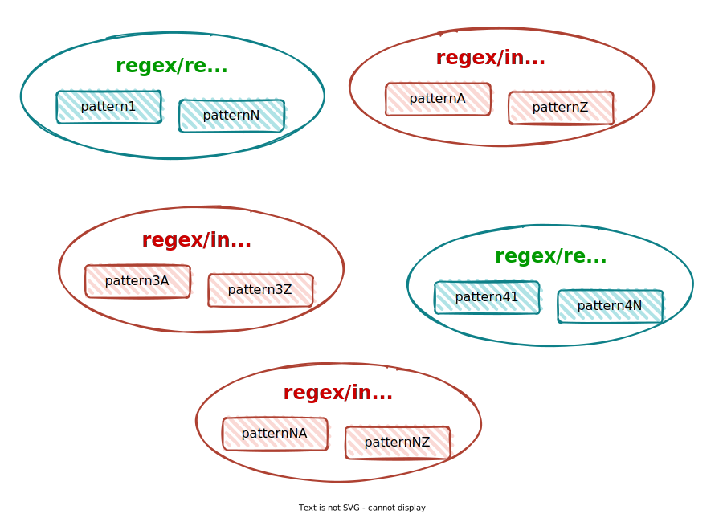

<p align="center">
  <br/>
  <a href="https://eslint-plugin-regex.github.io/"></a>
</p>

<h1 align="center">ESLint rules using Regular Expressions</h1>

[](https://eslint-plugin-regex.github.io/)
[](https://www.npmjs.com/package/eslint-plugin-regex)
[](https://www.npmjs.com/package/eslint-plugin-regex)
[](https://www.npmjs.com/package/eslint-plugin-regex)
[](LICENSE.txt)
[](https://gmullerb.gitlab.io/eslint-plugin-regex/coverage/index.html)
[](https://github.com/gmullerb/eslint-plugin-regex)
[](https://gitlab.com/gmullerb/eslint-plugin-regex)

__________________

## Quick Start

1 . Add dependencies:

`package.json`:

```json
  "engines" : {
    "node" : ">=6.0.0"
  },
  "devDependencies": {
    "eslint": ">=4.0.0",
    "eslint-plugin-regex": "1.10.0",
```

2 . Configure eslint:

Short configuration:

`.eslintrc.json`:

```json
{
  "plugins": [
    "regex"
  ],
  "rules": {
    "regex/invalid": [
      "error", [
        "invalidRegex1",
        "invalidRegexN"
      ]
    ],
    "regex/required": [
      "error", [
        "requiredRegex1",
        "requiredRegexN"
      ],
      "ignoreFilesRegex"
    ]
  }
}
```

Files will be checked for the absence of `invalidRegex1` and `invalidRegexN`, and for the presence of `requiredRegex1` and `requiredRegexN`, and files with name matching `ignoreFilesRegex` will not be checked.

Detailed configuration:

`.eslintrc.json`:

```json
{
  "plugins": [
    "regex"
  ],
  "rules": {
    "regex/invalid": [
      "error", [{
          "regex": "invalidRegex1",
          "replacement": "newValue"
        }, {
          "id": "regexIdN",
          "message": "errorMessageN",
          "regex": "invalidRegexN",
          "files": {
            "ignore": "ignoreFilesRegexN"
          }
        }
      ]
    ],
    "regex/required": [
      "error", [{
          "id": "regexId1",
          "regex": "requiredRegex1",
          "message": "errorMessage1",
          "files": {
            "inspect": "inspectFilesRegex1"
          }
        }, {
          "regex": "requiredRegexN",
          "files": {
            "ignore": "ignoreFilesRegexA",
            "inspect": "inspectFilesRegexZ"
          }
        }
      ]
    ]
  }
}
```

Files will be checked for:

* The absence of `invalidRegex1` but if found it will be replaced with `newValue`.
* The absence of `invalidRegexN` only in files with name not matching `ignoreFilesRegexN`, but if found `errorMessageN` will be shown.
* The presence of `requiredRegex1` only in files with name matching `inspectFilesRegex1`, but if not found `errorMessage1` will be shown.
* The presence of `requiredRegexN` only in files with name matching `inspectFilesRegexA` and not matching `ignoreFilesRegexZ`.

__________________

## Goals

The idea is to allow the creation of different eslint rules based on Regular Expressions in order to have some "freedom" to create quick ESLint custom rules.

## Rules

Name                                                  | Fixable | Description
----------------------------------------------------- | ------- | -----------
[`regex/invalid`](docs/rules/invalid-regex-rule.md)   | Yes     | checks that specified patterns are not found
[`regex/required`](docs/rules/required-regex-rule.md) | No      | checks that specified patterns are found

Each rule defines a set of patterns:


### 📏 `regex/invalid`

This rule checks that specified patterns are not found in files, i.e. **Invalid patterns**.

✏ Example of **incorrect** code for this rule:

```javascript
/* eslint regex/invalid: ['error', ['"']] */

const text = 'Hello "My Friend"'
```

The error message will reflect the exact location, e.g.:

```bash
/path/to/some.js
 34:25  error  Invalid regular expression /"/gm found  regex/invalid
```

✏ Example of **correct** code for this rule:

```javascript
/* eslint regex/invalid: ['error', ['"']] */

const text = 'Hello \'My Friend\''
```

### 📏 `regex/required`

This rule looks for specific patterns that must be present in each file, i.e. **Required patterns**.

✏ Example of **incorrect** code for this rule:

```javascript
/* eslint regex/required: ["error", ["^// Copyright My Friend"]] */

const text = 'Hello "My Friend"'
```

The error message will point to the beginning of the file, e.g.:

```sh
/path/to/some.js
 1:1  error  Required regular expression /^\/\/ Copyright My Friend/gm not found in file  regex/required
```

✏ Example of **correct** code for this rule:

```javascript
/* eslint regex/required: ["error", ["^// Copyright My Friend"]] */

// Copyright My Friend
const text = 'Hello "My Friend"'
```

### Options

Both rule has two options:

* **array** of patterns definitions to analyze. [REQUIRED]
  * Each pattern definition can be 'Short' or 'Detailed'.
* a **string** representing the regular expression for ignoring files for all patterns. [OPTIONAL]

```json
[
  "error",
  [
    "regex1",
    "regexN"
  ],
  "ignoreFilesRegex"
]
```

#### The *string* representing the regular expression

Remember, Slashes (`/`) are not required in the string that defines the regex,

e.g. To get the following regex `/^(test|spec)$/`, define:

* **`"^(test|spec)$"`**, when using `.eslintrc.js` or `.eslintrc.json`.

e.g. To get the following regex `/\bhttp:/`, define:

* **`"\bhttp:"`**, when using `.eslintrc.js`, or
* **`"\\bhttp:"`**, when using `.eslintrc.json`. (backslash needs to be double in a json file)

e.g. To get the following regex `/.*test\.js/`, define:

* **`".*test\.js"`**, when using `.eslintrc.js`, or
* **`".*test\\.js"`**, when using `.eslintrc.json`. (backslash needs to be double in a json file)

#### Short pattern definition

Each pattern is specified by just a **`string`** representing the regular expression, i.e. `"regex"`

```json
{
  "regex/invalid": [
    "error",
    [
      "invalidRegex1",
      "invalidRegexN"
    ]
  ],
  "regex/required": [
    "error",
    [
      "requiredRegex1",
      "requiredRegexN"
    ]
  ]
}
```

#### Detailed pattern definition

It is specified by an `object`, with the following fields:

* `regex`: A **required** `string` for `regex/required` and `regex/invalid` representing the **Regular expression to look for**. [REQUIRED]
* `flags`: A combination of flags, `i`, `s` and/or `u`, to be used by the Regular Expression. [OPTIONAL]
* `replacement` for `regex/invalid` [1]: [OPTIONAL]
  * An optional `string` used to replace the **invalid** found pattern, or
  * An optional `object` that establish how the **invalid** found pattern will be replaced:
    * `function`: used to replace the **invalid** found pattern.
      * It will receive 3 parameters: `text`, `captured` and `$`, that can be used as desired.
      * It must return a `string` value, if not, return value will be ignored.
      * Its definition must be only the body of the function.
  * One must be defined, either the `string` or `function`.
* `id`: An optional `string` representing the **Pattern Id**. [OPTIONAL]
* `message`: An optional `string` specifying the **Message to be shown when an error happens** (invalid `regex` is found or required `regex` is not found). [OPTIONAL]
* `files`: An optional `object` specifying which files to analyze: [OPTIONAL]
  * `ignore`: A `string` representing **Regular expression of the files to be ignored** when validating this specific pattern.
  * `inspect`:  A `string` representing **Regular expression of the files to be inspected** when validating this specific pattern.

```json
{
  "id": "regexId",
  "regex": "regex",
  "flags": "isu",
  "replacement": "replacementString",
  "message": "errorMessage",
  "files": {
    "ignore": "ignoreFilesRegex",
    "inspect": "inspectFilesRegex"
  }
}
```

> * `regex` is the **only** Required field.
> * When `ignore` and `inspect` are present, `ignore` takes precedence.
> * Global ignore file pattern, takes precedence over `files` patterns.
>
> [1] In order to fix issues `eslint` must be run with `--fix` option.

Using `message` is pretty useful since it will give a better understanding to the developer when an error happens:

e.g. Given the following definition:

```json
{
  "regex": "someRegex",
  "message": "The Useful Error MessagE"
}
```

then shown error will be similar to:

```sh
/path/to/some.js
 1:1  error  The Useful Error MessagE  regex/required
```

or

```bash
/path/to/some.js
 34:25  error  The Useful Error MessagE  regex/invalid
```

instead of

```sh
/path/to/some.js
 1:1  error  Required regular expression /someRegex/gm not found in file  regex/required
```

or

```bash
/path/to/some.js
 34:25  error  Invalid regular expression /someRegex/gm found  regex/invalid
```

##### Definition of the Function used to replace the *invalid* found pattern

Definition of the function must be done as a `string` in 1 line, and the following rules apply:

* It must return a `string` value, if not, return value will be ignored, i.e. it will silently fail.
* Its definition must be **only the body of the function**.
  * For "simple" functions where the `return` is found at the beginning of the body of the function and the **exact** word *return* is not present, `return` can be omitted.
* If the function has invalid Javascript code, the function will be ignored, i.e. it will silently fail.

Function will receive 3 parameters, to be used as desired:

* `text`: a `string` with the value of the invalid text found.
* `captured`: an `array` of strings with the values of the captured groups for the regex.
* `$`: an `array` of strings, with the value of the invalid text found plus the values of the captured groups for the regex, i.e.
  * `$[0]` = `text`: a `string` with the value of the invalid text found.
  * `$[1..]` = `captured`: an `array` of strings with the values of the captured groups for the regex.
    * `$[1]` = `captured[0]` and so on.
  * It allows smaller definitions.

**Using parameter `text`**

e.g.

```javascript
  function(text, captured, $) {
    return text.trim()
  }
```

`"return text.trim()"` => only the body of the function + returns a `string` value based on `text`

Having the following rule in `.eslintrc.json`:

```json
{
  "id": "regexIdN",
  "regex": "\\serror\\w*\\s",
  "replacement": {
    "function": "return text.trim()"
  }
}
```

or using `$`:

```json
{
  "id": "regexIdN",
  "regex": "\\serror\\w*\\s",
  "replacement": {
    "function": "return $[0].trim()"
  }
}
```

then, given:

`example.js`

```javascript
const exception = " error19 "
```

when linting with fix, the result will be:

```javascript
const exception = "error19"
```

As the body of the function is "simple", i.e. the `return` is found at the beginning of the body of the function, and besides, the word *return* is not present, then the definition could be done as:

```json
{
  "id": "regexIdN",
  "regex": "\\serror\\w*\\s",
  "replacement": {
    "function": "text.trim()"
  }
}
```

or

```json
{
  "id": "regexIdN",
  "regex": "\\serror\\w*\\s",
  "replacement": {
    "function": "$[0].trim()"
  }
}
```

**Using parameter `captured`**

e.g.

`"return captured[0]"` => only the body of the function + returns a `string` value based on `captured`

Having the following rule in `.eslintrc.json`:

```json
{
  "id": "regexIdN",
  "regex": "\\serror(\\w*)\\s",
  "replacement": {
    "function": "return captured[0]"
  }
}
```

or using `$`:

```json
{
  "id": "regexIdN",
  "regex": "\\serror(\\w*)\\s",
  "replacement": {
    "function": "return $[1]"
  }
}
```

then, given:

`example.js`

```javascript
const exception = " error19 "
```

when linting with fix, the result will be:

```javascript
const exception = "19"
```

As the body of the function is "simple", i.e. the `return` is found at the beginning of the body of the function, and besides, the word *return* is not present, then the definition could be done as:

```json
{
  "id": "regexIdN",
  "regex": "\\serror(\\w*)\\s",
  "replacement": {
    "function": "captured[0]"
  }
}
```

or

```json
{
  "id": "regexIdN",
  "regex": "\\serror(\\w*)\\s",
  "replacement": {
    "function": "$[1]"
  }
}
```

**Using parameters `text` and `captured`**

e.g.

`"return text + ' = ' + captured[0]  + ' + ' + captured[1] + ' = ' + (parseInt(captured[0]) + parseInt(captured[1]))"` => only the body of the function + returns a `string` value based on `text` and `captured`

Having the following rule in `.eslintrc.json`:

```json
{
  "id": "regexIdN",
  "regex": "(\\d+)\\+(\\d+)",
  "replacement": {
    "function": "return text + ' = ' + captured[0]  + ' + ' + captured[1] + ' = ' + (parseInt(captured[0]) + parseInt(captured[1]))"
  }
}
```

or using `$`:

```json
{
  "id": "regexIdN",
  "regex": "(\\d+)\\+(\\d+)",
  "replacement": {
    "function": "return $[0] + ' = ' + $[1]  + ' + ' + $[2] + ' = ' + (parseInt($[1]) + parseInt($[2]))"
  }
}
```

or :

```json
{
  "id": "regexIdN",
  "regex": "(\\d+)\\+(\\d+)",
  "replacement": {
    "function": "return text + ' = ' + $[1]  + ' + ' + $[2] + ' = ' + (parseInt($[1]) + parseInt($[2]))"
  }
}
```

or :

```json
{
  "id": "regexIdN",
  "regex": "(\\d+)\\+(\\d+)",
  "replacement": {
    "function": "return `${text} = ${captured[0]} + ${captured[1]} = ${parseInt($[1]) + parseInt($[2])}`"
  }
}
```

then, given:

`example.js`

```javascript
const sum = "4+5"
```

when linting with fix, the result will be:

```javascript
const sum = "4+5 = 4 + 5 = 9"
```

As the body of the function is "simple", i.e. the `return` is found at the beginning of the body of the function, and besides, the word *return* is not present, then the definition could be done as:

```json
{
  "id": "regexIdN",
  "regex": "(\\d+)\\+(\\d+)",
  "replacement": {
    "function": "text + ' = ' + $[1]  + ' + ' + $[2] + ' = ' + (parseInt($[1]) + parseInt($[2]))"
  }
}
```

or :

```json
{
  "id": "regexIdN",
  "regex": "(\\d+)\\+(\\d+)",
  "replacement": {
    "function": "`${text} = ${captured[0]} + ${captured[1]} = ${parseInt($[1]) + parseInt($[2])}`"
  }
}
```

**When `return` keyword is required**

e.g.

e.g. `const result = text === 'superb' ? 'Superb' : text; return result` => only the body of the function + returns a `string` value based on `text`.

Since the `return` is not found at the beginning of the body of the function, `return` cannot be omitted, then rule definition will be as usual:

```json
{
  "id": "regexIdN",
  "regex": "\\w+",
  "replacement": {
    "function": "const result = text === 'superb' ? 'Superb' : text; return result"
  }
}
```

> Some cases may use Comma operator, e.g. `"function": "result = text === 'superb' ? 'Superb' : text, result"`

e.g. `return text === 'return' ? 'Return' : text` => only the body of the function + returns a `string` value based on `text`.

Since the *exact* word *return* is present, this will **required** `return`, then rule definition will be as usual:

```json
{
  "id": "regexIdN",
  "regex": "\\w+",
  "replacement": {
    "function": "return text === 'return' ? 'Return' : text"
  }
}
```

Following case does not required `return`:

e.g. `return text === 'Return' ? 'RETURN' : text` => only the body of the function + returns a `string` value based on `text`.

Since the **exact** word *return* is not present, this will allow the following rule definition to be:

```json
{
  "id": "regexIdN",
  "regex": "\\w+",
  "replacement": {
    "function": "text === 'Return' ? 'RETURN' : text"
  }
}
```

###### Debugging of the Replacement Function for *invalid* found pattern

* It is possible to add `console` statements to print some information in the Replacement Function.

```json
{
  "regex": "\\serror(\\w*)\\s",
  "replacement": {
    "function": "const extract = captured[0]; console.log(extract); return extract"
  }
}
```

##### RegExp Flags

The following flags can be add to the regex:

* `i`: For case insensitive search.
* `s`: To allow `.` to match newline characters.
* `u`: To treat the regex as a sequence of unicode code points.

To define the flags to be used, employ the field `flags` in the detailed pattern:

* A combination of flags can be used, e.g. `"is"`.
  * Order of flags is irrelevant, e.g. `"si"`.
* It's case insensitive, e.g. `"iS"`, `"Is"` and `"IS"` are the same.
* Invalid flags will be reported as an error by eslint.

> By default, `"gm"` is always added by the engine (since It's required).

e.g.

Having the following detailed pattern:

```json
{
  "regex": "invalid",
  "flags": "i"
}
```

`Invalid`, `inValid`, `INvalid` or `INVALID` will match.

### String to Regular expression conversion

Internally, each string from the array will be converted into a Regular Expression with `global` and `multiline` options, e.g.:

`"someRegex"` will be transformed into `/someRegex/gm`

> Remember that backslash needs to be double in strings of a json file, e.g. To get the following regex `/\bhttp:/` define the following string `"\\bhttp:"`.

### Empty Meta characters

For some special cases when using meta characters that may result in an empty match, e.g. `^`, eslint-plugin-regex will report only the first case found, and after that case is fixed, the following will be report, if present.

e.g.

```json
{
  "regex": "^(?!(?:(feature|fix|docs|config|refactor|revert|test).*[\\.:]$)|(\\*\\s\\w.*\\.$)|$)"
}
```

`/path/to/some.js`:

```text
config(ALL):

* Use eslint-plugin-regex for commit message linting
* Use eslint-plugin-regex for commit message linting
```

When linting, `eslint-plugin-regex` will only report the first case:

```bash
/path/to/some.js
 3:1  error  Invalid regular expression /^(?!(?:(feature|fix|docs|config|refactor|revert|test).*[\\.:]$)|(\\*\\s\\w.*\\.$)|$)/gm found  regex/invalid
```

4:1  error will not be reported until 3:1 is fixed.

> The issue is that having an empty match does not allow the regex engine to move forward.

### Error report

The 'Short pattern definition' errors are reported with the following structure:

Given `someRegex`, the following message will be shown on error:

```
Invalid regular expression /someRegex/gm found
```

or

```
Required regular expression /someRegex/gm not found in file
```

The 'Detailed pattern definition' errors are reported with the following rules:

A . If `message` is present then that **exact message is reported**.  
B . If `id` is present then:

Given `"id": "someRegexId"`, the following message will be shown on error:

```
Invalid regular expression 'someRegexId' found
```

or

```
Required regular expression 'someRegexId' not found in file
```

C . If neither `message` nor `id` is present then the 'Short pattern definition' error message is shown.

> * `message` takes precedence over `id`.  
> * Although `id` is a quick solution (and useful when creating and testing a rule), using `message` will give more information to the team about the issue.

### Mixing

#### Mixing pattern types

It is possible to use both type of definitions, 'Short pattern definition' with 'Detailed pattern definition', in the array of patterns.

`.eslintrc.json`:

```json
{
  "plugins": [
    "regex"
  ],
  "rules": {
    "regex/invalid": [
      "error", [
        "invalidRegex1",
        "invalidRegex2",
        {
          "regex": "invalidRegex3",
          "message": "errorMessage1",
          "files": {
            "inspect": "inspectFilesRegex1"
          }
        },
        {
          "id": "regexIdN",
          "regex": "invalidRegexN",
          "files": {
            "ignore": "ignoreFilesRegexN"
          }
        }
      ]
    ]
  }
}
```

* `invalidRegex1` and `invalidRegex2` are 'Short pattern definition'.
* `invalidRegex3` and `invalidRegexN` are 'Detailed pattern definition'.

#### Mixing rules

##### Mixing error levels

Rules names have synonyms:

`regex/invalid` = `regex/invalid-warn` = `regex/invalid-error` = `regex/another-invalid` = `regex/other-invalid`.

`regex/required` = `regex/required-warn` = `regex/required-error` = `regex/another-required` = `regex/other-required`.

* Synonyms are just that, synonyms, do not imply any level of error, but some are provided to increase readability, e.g. `regex/invalid-warn` does not imply `warn` level.
* This will allow to mix different error levels.

It is possible to set different error level: `error`, `warn` and `off`. For this use a synonym for the regex rule name:

`.eslintrc.json`:

```json
{
  "plugins": [
    "regex"
  ],
  "rules": {
    "regex/invalid": [
      "error",
      [
        "invalidRegex1",
        "invalidRegexN"
      ]
    ],
    "regex/required": [
      "error",
      [
        "requiredRegex1",
        "requiredRegexN"
      ]
    ],
    "regex/invalid-error": [
      "error", [
        "invalidRegexA1",
        "invalidRegexA2",
        {
          "regex": "invalidRegexA3",
          "message": "errorMessage1",
          "files": {
            "inspect": "inspectFilesRegexA1"
          }
        },
        {
          "id": "regexIdN",
          "regex": "invalidRegexN",
          "files": {
            "ignore": "ignoreFilesRegexAN"
          }
        }
      ],
    ],
    "regex/invalid-warn": [
      "warn", [
        "invalidRegexB1",
        "invalidRegexB2",
        {
          "regex": "invalidRegexB3",
          "message": "errorMessage1",
          "files": {
            "inspect": "inspectFilesRegex1"
          }
        },
        {
          "id": "regexIdN",
          "regex": "invalidRegexBN",
          "files": {
            "ignore": "ignoreFilesRegexN"
          }
        }
      ],
    ],
    "regex/other-invalid": [
      "off", [
        "invalidRegexC1",
        "invalidRegexC2",
        {
          "regex": "invalidRegexB3",
          "message": "errorMessage1",
          "files": {
            "inspect": "inspectFilesRegexC1"
          }
        },
        {
          "id": "regexIdN",
          "regex": "invalidRegexBN",
          "files": {
            "ignore": "ignoreFilesRegexCN"
          }
        }
      ],
    ],
    "regex/required-warn": [
      "warn",
      [
        "requiredRegexA1",
        "requiredRegexAN"
      ]
    ]
  }
}
```

* Rules with invalid patterns and `error` level: `regex/invalid` and `regex/invalid-error`.
* Rules with invalid patterns and `off` level: `regex/other-invalid`.
* Rules with required patterns and `error` level: `regex/required`.
* Rules with required patterns and `warn` level: `regex/required-warn`.

##### Custom set of regex rules

Creating and Using a Custom Set of regex rules **requires using `js` files**.

###### Named Regex Rules approach

A regex rule can be named with a custom name. The Rule name can be anything that **includes `invalid`, `disuse`, `avoid`, `required` or `use`**, ignoring letter case, and with the restrictions of predefined names (`invalid`, `disuse`, `avoid`, `invalid-warn`, `invalid-error`, `another-invalid`, `other-invalid`, `required`, `use`, `required-warn`, `required-error`, `another-required` and `other-required`).

* `regex/*invalid*`, `regex/*disuse*`  or `regex/*avoid*` for invalid patterns.
* `regex/*required*` or `regex/*use*` for required patterns.



> In the name `invalid`, `disuse` and `avoid` will take precedence over `required` and `use`, e.g. If custom regex rule name has both `avoid` and `use` in the name, then the respective regex patterns will be consider invalid patterns.

**`addRegexRuleName` must be used to add the custom regex rule name to the set of `eslint-plugin-regex` rules.**

```javascript
const { addRegexRuleName } = require('eslint-plugin-regex')

addRegexRuleName('*invalid*')
addRegexRuleName('*required*')
```

* If the custom regex rule name is already defined, then an error will be shown:

```sh
Error: Cannot read config file: /path/to/.eslintrc.js
Error: "SomeRuleName" already defined as eslint-plugin-regex rule name
```

***Local Custom Regex rules***

Create a local `.eslintrc.js`:

1 . Add rule name using `addRegexRuleName`.  
2 . Define `eslint-plugin-regex` custom regex rule.

```javascript
const { addRegexRuleName } = require('eslint-plugin-regex')

addRegexRuleName('invalid-custom-890')

module.exports = {
  plugins: [ 'regex' ],
  rules: {
    'regex/invalid-custom-890': [
      'error', [
        {
          regex: 'invalidRegexBN',
          files: {
            ignore: 'ignoreFilesRegexCN'
          }
        }
      ]
    ]
  }
}
```

***Custom Regex rules package***

Create a custom ESLint package and add the custom regex rules with a **"unique"** name for each regex rule defined in the package, so it can be use with other package of regex rules or local regex rules.

Custom package `index.js`:

```javascript
const { addRegexRuleName } = require('eslint-plugin-regex')

addRegexRuleName('invalid-custom-890')

module.exports = {
  configs: {
    'someRegexRule1': {
      plugins: [ 'regex' ],
      rules: {
        'regex/invalid-custom-890': [
          'error', [
            {
              regex: 'invalidRegexBN',
              files: {
                ignore: 'ignoreFilesRegexCN'
              }
            }
          ]
        ]
      }
    }
  }
}
```

* This custom package defines 1 rule named `regex/invalid-custom-890` with only 1 invalid pattern with `error` as a default error level.

> An online example can be checked at [`eslint-plugin-base-style-config`](https://github.com/gmullerb/base-style-config/tree/master/js#regex-rules).  
> For more information on how to create a custom ESLint package check [ESLint official documentation: Working with Plugins](https://eslint.org/docs/developer-guide/working-with-plugins)

then use it,

Some project `.eslintrc.json`:

```json
  { "extends": [ "plugin:the-eslint-plugin/someRegexRule1",
```

to change the default error level set by the package:

```json
  {
    "extends": [ "plugin:the-eslint-plugin/someRegexRule1" ],
    "rules": {
      "regex/invalid-custom-890": "warn"

```

mixing with other regex rules:

```json
{
  "extends": [ "plugin:the-eslint-plugin/someRegexRule1" ],
  "rules": {
    "regex/invalid-custom-890": "warn",
    "regex/required": [
      "error",
      [
        "requiredRegex1",
        "requiredRegexN"
      ]
    ],
    "regex/invalid-error": [
      "error", [
        "invalidRegexA1",
        "invalidRegexA2",
        {
          "regex": "invalidRegexA3",
          "message": "errorMessage1",
          "files": {
            "inspect": "inspectFilesRegexA1"
          }
        },
        {
          "id": "regexIdN",
          "regex": "invalidRegexN",
          "files": {
            "ignore": "ignoreFilesRegexAN"
          }
        }
      ],
    ],
```

***Advantages***

* Using Named Regex rule name will allow to have a **set of different regex rule**:
  * Each rule with totally different settings.
    * Allow to mix different regular expressions.
    * Allow to mix different error levels.
    * etc.
  * Easily create custom regex rules package.
* When using Named Regex Rules, shown **errors will be even more specific**, e.g.:

```javascript
const { addRegexRuleName } = require('eslint-plugin-regex')

addRegexRuleName('required-custom-896')
```

then, if an error happens, the output will be something similar to:

```sh
/path/to/some.js
  1:1  error  Required regular expression /requiredRegex/gm not found in file  regex/required-custom-896
```

instead of

```sh
/path/to/some.js
  1:1  error  Required regular expression /requiredRegex/gm not found in file  regex/required
```

###### Import/Export approach

Create a custom npm package using either with `json` or `js` files and add the custom regex rules.

Custom package `index.js`:

with complete rule definition:

```javascript
module.exports = {
  regex: 'invalidRegexBN',
  files: {
    ignore: 'ignoreFilesRegexCN'
  }
}
```

or

```javascript
module.exports = {
  regex: 'invalidRegexBN',
}
```

or with only regex definition:

```javascript
module.exports = 'invalidRegexBN'
```

or with multiple complete rule definition:

```javascript
module.exports = {
 ruleName1: {
    regex: 'invalidRegex1',
    files: {
      ignore: 'ignoreFilesRegex1'
    }
  },
  ruleNameN: {
    regex: 'invalidRegexN',
    files: {
      ignore: 'ignoreFilesRegexN'
    }
  }
}
```

or

```javascript
module.exports = {
  ruleName1: {
    regex: 'invalidRegex1',
  },
  ruleNameN: {
    regex: 'invalidRegexN',
  }
}
```

or with multiple only regex definition:

```javascript
module.exports = {
    ruleName1: 'invalidRegex1',
    ruleNameN: 'invalidRegexN'
}
```

or using `json` files:

```json
{
  "regex": "invalidRegexBN",
  "files": {
    "ignore": "ignoreFilesRegexCN"
  }
}
```

or

```json
{
  "regex": "invalidRegexBN",
}
```

or

```json
{
 "ruleName1": {
    "regex": "invalidRegex1",
    "files": {
      "ignore": "ignoreFilesRegex1"
    }
  },
  "ruleNameN": {
    "regex": "invalidRegexN",
    "files": {
      "ignore": "ignoreFilesRegexN"
    }
  }
}
```

or

```json
{
  "ruleName1": {
    "regex": "invalidRegex1",
  },
  "ruleNameN": {
    "regex": "invalidRegexN",
  }
}
```

or

```json
{
    "ruleName1": "invalidRegex1",
    "ruleNameN": "invalidRegexN"
}
```

> Different approaches can be defined, these are only a glance.
> For more information on how to create a custom npm package check [Contributing packages to the registry](https://docs.npmjs.com/packages-and-modules/contributing-packages-to-the-registry)

Then use the custom package:

Some project `.eslintrc.js`:

```javascript
  import * as SomeESLintSetOfRegexRulesPackage1 from 'the-custom-package1'
  import * as SomeESLintSetOfRegexRulesPackage2 from 'the-custom-package2'

  module.exports = {
    plugins: ["regex"],
    rules: {
      "regex/invalid": [
        'error', [
          SomeESLintSetOfRegexRulesPackage1.ruleName1,
          SomeESLintSetOfRegexRulesPackage1.ruleNameN,
          SomeESLintSetOfRegexRulesPackage2.ruleName1,
          SomeESLintSetOfRegexRulesPackage2.ruleNameN
        ]
      ],
```

or using synonyms to mix error levels:

```javascript
  import * as SomeESLintSetOfRegexRulesPackage1 from 'the-custom-package1'
  import * as SomeESLintSetOfRegexRulesPackage2 from 'the-custom-package2'

  module.exports = {
    plugins: ["regex"],
    rules: {
      'regex/invalid-error': [
        'error', [
          SomeESLintSetOfRegexRulesPackage1.ruleNameN,
          SomeESLintSetOfRegexRulesPackage2.ruleName1
        ]
      ],
      'regex/invalid-warn': [
        'warn', [
          SomeESLintSetOfRegexRulesPackage1.ruleName1,
          SomeESLintSetOfRegexRulesPackage2.ruleNameN
        ]
      ]
```

### `regex/invalid` vs `regex/required`

Both rule were design with *binary* approach:

* `regex/invalid`: pattern **is not present** => any presence of the *specific* pattern in a file is invalid.
* `regex/required`: pattern **is present** => only 1 presence of the *specific* pattern in a file is required.

Array of patterns represent different logical operation for each rule:

* `regex/invalid`: **OR** => the presence in a file of *any* of the patterns defined in the *array* is invalid.
* `regex/required`: **AND** => the presence in file of *all* of the patterns defined in the *array* is required.

### Examples

Check:

* [invalid-regex Basic rule tests](tests/lib/rules/invalid-regex-rule.e2e-test.js)
* [invalid-regex Detailed rule tests](tests/lib/rules/invalid-regex-detailed-rule.e2e-test.js)
* [required-regex Basic rule tests](tests/lib/rules/required-regex-rule.e2e-test.js)
* [required-regex Detailed rule tests](tests/lib/rules/required-regex-detailed-rule.e2e-test.js)
* [The set of Regex Rules of `eslint-plugin-base-style-config`](https://github.com/gmullerb/base-style-config/tree/master/js#regex-rules)

__________________

## Prerequisites

* [`"eslint": ">=4.0.0"`](https://www.npmjs.com/package/eslint).

__________________

## Evolution

[`CHANGELOG.md`](CHANGELOG.md): contains the information about changes in each version, chronologically ordered ([Keep a Changelog](http://keepachangelog.com)).

## Extending/Developing

[Developing](js/.readme/developing.md)

## Contributing

* **Use it**.
* **Share it**.
* [Give it a Star](https://github.com/gmullerb/eslint-plugin-regex).
* [Propose changes or improvements](https://github.com/gmullerb/eslint-plugin-regex/issues).
* [Report bugs](https://github.com/gmullerb/eslint-plugin-regex/issues).

## License

[MIT License](LICENSE.txt)

__________________

## Remember

* Use code style verification tools => Encourages Best Practices, Efficiency, Readability and Learnability.
* Code Review everything => Encourages Functional suitability, Performance Efficiency and Teamwork.
* If viable, Start testing early => Encourages Reliability and Maintainability.

## Additional words

Don't forget:

* **Love what you do**.
* **Learn everyday**.
* **Learn yourself**.
* **Share your knowledge**.
* **Think different!**.
* **Learn from the past, dream on the future, live and enjoy the present to the max!**.
* **Enjoy and Value the Quest** (It's where you learn and grow).

At life:

* Let's act, not complain.
* Be flexible.

At work:

* Let's give solutions, not questions.
* Aim to simplicity not intellectualism.
